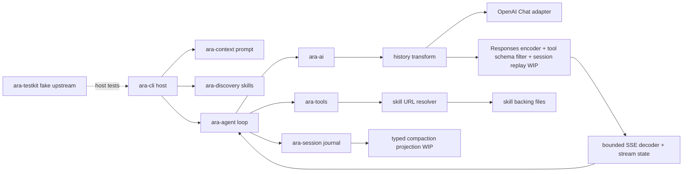

# Handoff 2026-09-27: Agent compaction projection and Responses host WIP

This is temporary status. The point receipt is
[CTX-01d skill URL tools](../evidence/ctx-01d-skill-url-tools.md) and
[skill read resources](../evidence/ctx-01d-skill-read-resources.md), plus
[AI-01e Responses stream](../evidence/ai-01e-responses-stream.md),
[AI-01e Responses reasoning](../evidence/ai-01e-responses-reasoning.md),
[AI-01e incomplete history](../evidence/ai-01e-responses-incomplete-history.md),
[AI-01e tool schema](../evidence/ai-01e-responses-tool-schema.md),
[AI-01e delayed tool results](../evidence/ai-01e-delayed-tool-results.md) and
[malformed tool calls](../evidence/ai-01e-malformed-tool-calls.md) and
[composite tool IDs](../evidence/ai-01e-composite-tool-ids.md); accepted
fractions come from the [feature ledger](../upstream/feature-ledger.md) and
[roadmap](../roadmap.md).

## Progress and estimate

**Overall P0–P6: 1/7 gates, 14.3% accepted.** Registered feature points:
27/36 accepted (75.0% of only the registered points). WIP tests do not add
partial acceptance.

| Module | Accepted points | Current state |
| --- | ---: | --- |
| AI | 6/7 | Responses HTTP/SSE, cold/warm and incomplete native history are WIP; full provider parity and delivery gate open. |
| AGT | 4/8 | Agent queues, tokenizer and compaction pieces WIP. |
| SES | 3/3 | Journal slice accepted; compaction replay and cross-process guard open. |
| TOOLS | 9/9 | Registered slices accepted; skill URL resource reads added as CTX WIP; Windows Bash process-tree failures remain. |
| CTX | 3/5 | CTX-01d changes requested; CTX-01e host invocation open. |
| CLI | 2/3 | Responses route has real-process tool, reasoning, restart and JSON fixtures; Windows deadline e2e remains red. |
| TK | 0/1 | Fake upstream tested, not accepted. |

The next local Windows protocol checkpoint is **2–4 working days** for the
remaining Responses differences, bounded real-model evidence and delivery
review (low confidence). The full P0–P6
plan remains **4–8+ months** (low confidence). These are estimates, not a
claimed completion date.

The current AI-01e text/function HTTP, CLI host and truncated-turn recovery
slice is WIP. Its controlled-upstream and live-client checks are in place.
Identifierless parallel argument routing is now implemented as WIP with
source-backed state cases, two real CLI `write` effects and conflict rejection.
It follows fixed OMP's arrival-order inference; when final arguments are
empty, wire identity cannot be independently proven, so that remains an open
parity risk. Independent plan and diff review found and resolved a three-call
route error and a terminal-snapshot conflict bypass. The next protocol
checkpoint still needs the Windows gate and model evidence (low confidence).
A bounded real-model task, complete backend gate and point audit remain
additional acceptance gates; their estimate is **3–7 working days after the
route and Windows deadline scope are resolved** (low confidence). No
acceptance count changes yet. Keep module, overall, architecture and ETA
reports current at each checkpoint.

The reasoning continuation now captures Thinking events and a same-endpoint
native output snapshot. A real CLI process with a controlled fake upstream
proves same-process warm replay, cold `--resume`, a tool effect, paired results,
request include and JSON-event redaction. A fake HTTP test covers failed and
retried cold calls before warmup. Explicit `--reasoning` is required on each
CLI process. Workspace Clippy, doc tests, deny and inventory pass; the full
test gate remains red on the existing Windows deadline case (25/26 CLI e2e
with Git Bash in PATH), and full formatting still reports vendored differences.
A bounded actual-model trial remains open. See
[reasoning evidence](../evidence/ai-01e-responses-reasoning.md).

The current A3 read-only compaction projection slice is implemented and
independently reviewed as WIP. The next A3 checkpoint—durable write, restart
projection in the host, and fault tests—is estimated at **5–10 working days
after the Session write-path scope is confirmed** (low confidence). It does
not include the separate real-model and full acceptance gates.

The current Session slice projects the latest soft compaction as a typed
summary followed by kept and later source-tagged messages, while preserving
the raw branch. The new API is read-only and not connected to CLI/Agent model
requests. See [AGT-COMPACTIONe](../evidence/agt-compaction-projection.md).
The preceding AI slice pairs Responses-origin composite IDs in `ara-ai::transform`
and maps their results to the IDs emitted by the OpenAI Chat adapter. The
prior CTX slice changed `ara-tools::read` for resolved skill
resources; earlier WIP slices routed `grep`, `glob` and `write` through the
skill URL resolver. The Agent loop, Session writer, Bash process lifecycle
and vendored edit path policy were not changed in this slice.

## Current code and evidence

- Current WIP Responses generic tool schema: the request encoder visits only
  schema positions, normalizes empty/object/`oneOf`/lookaround cases, omits
  individual tools with conflicting `enum` or `const`, and computes forced
  `tool_choice` from emitted tools. A fake HTTP capture verifies the actual
  outbound request. The final-code `ara-ai` run passes 98 unit, 48 Chat HTTP
  and 12 Responses HTTP tests; focused Responses CLI e2e passes 9/9.
  Workspace Clippy, doc tests, `cargo deny`,
  fixed OMP inventory and scoped format pass. Full workspace tests stop at the
  existing Windows CLI deadline timing assertion (27/28 e2e); full format is
  red in unchanged vendored `pi-*` files. Independent Codex plan, source and
  final diff reviews found and corrected empty-node normalization and
  diagnostic escaping; no blocking finding remains. Draft-07 upgrade, strict
  mode, vendor dialects, full gate and bounded real-model evidence are open.
  See [tool schema receipt](../evidence/ai-01e-responses-tool-schema.md).
- Current WIP Responses incomplete history: successful truncated turns now
  save native items. Visible text with reasoning warms the same-process
  provider; `--resume` starts cold. Hidden-only output is saved without
  warming. Mixed visible output plus a partial tool call now replays valid
  native items and turns the filtered call's synthetic result into an
  assistant orphan note; the partial call is not executed or replayed as a
  function call. Open terminal arguments keep raw parse-error markers. AI
  tests pass 96 unit, 48 Chat HTTP and 11 Responses HTTP; the Responses CLI
  slice passes 9/9, including real-process Session and restart cases.
  Strict workspace Clippy, doc tests, dependency policy and fixed inventory
  pass. With Git Bash in PATH, full CLI e2e remains 27/28 due to the existing
  Windows deadline timing assertion; workspace format remains red in vendored
  `pi-*`. Independent Codex source and diff review found no new blocking
  defect. The backend gate and bounded real-model task remain open. See the
  [incomplete history receipt](../evidence/ai-01e-responses-incomplete-history.md).
- Current WIP Responses native replay starts cold per CLI process, warms only
  after a replayable successful response, and becomes cold again on `--resume`.
  New snapshots declare `dt:true`; old ARA snapshots without `dt` keep their
  incremental meaning, while explicit full snapshots fall back to visible
  history. AI tests pass 92 unit, 48 Chat HTTP and 9 Responses HTTP; the
  Responses CLI slice passes 7/7. With Git Bash in PATH, full CLI e2e passes
  25/26 and still fails the existing Windows tool deadline assertion. Workspace
  Clippy, docs, dependency policy and fixed OMP inventory pass; full format
  remains red on vendored `pi-edit`. Independent Codex source/plan/diff review
  found no remaining high-confidence P1/P2 issue. See the
  [reasoning receipt](../evidence/ai-01e-responses-reasoning.md). AI, P0–P6
  and overall registered-point acceptance remain unchanged.
- Current WIP identifierless Responses arguments: strict JSON prefix
  classification, added-order routing, sticky delta target, final/snapshot
  contradiction rejection, duplicate call-ID rejection and cumulative scan
  limit. `ara-ai` passes 84 unit, 48 Chat HTTP and 5 Responses HTTP cases;
  two new real-process CLI cases pass. Workspace Clippy, doc tests, deny and
  OMP inventory checks pass. Full workspace tests remain red at existing
  Windows CLI deadline and Bash process-tree cases; with those skipped, the
  vendored `pi-edit` hashline path fixtures also fail. The workspace format
  check still reports unrelated vendored formatting. Complete backend gate
  and bounded real-model task remain open. See the
  [Responses receipt](../evidence/ai-01e-responses-stream.md). No module or
  overall acceptance count changed.
- Current WIP Responses path connects the stateless request encoder to bounded
  SSE decoding, stream state, `ModelProvider`, and `--api openai-responses`.
  A real CLI task writes a file and replays its result after restart.
  Truncated parallel calls now produce `Length` and two non-execution results;
  both same-run and post-restart continuation were tested with no file
  effects. JSON clients receive text before the terminal frame; cancelling
  a partial tool remains `Aborted`. `cargo test -p ara-ai --quiet` passed
  78 unit, 48 Chat HTTP and 5 Responses HTTP tests. The full CLI e2e was
  22/23 with Git Bash in PATH; only the existing Windows tool-deadline test
  failed. Strict scoped Clippy and format checks passed. Independent Codex
  plan/diff reviewers found no high-confidence P0/P1 in this continuation.
  See [Responses stream and host evidence](../evidence/ai-01e-responses-stream.md).
  Full gate, real-model task and acceptance remain open.
- Current WIP Session projection: `cargo test -p ara-session` passed 27/27;
  scoped format and strict Clippy passed. On final code the full backend
  verifier passed formatting and workspace Clippy, then stopped at the known
  Windows CLI `deadline_during_a_tool_and_zero_budget_exit_nonzero` timing
  assertion (18/19 CLI e2e). Log:
  `%TEMP%\ara-compaction-projection-final-gate.log`. An earlier candidate
  run stopped at an Agent deadline test; its exact rerun passed. Workspace
  doc tests, `cargo deny check`, and pinned OMP inventory check passed
  separately. Independent Codex review found and helped correct unsafe turn
  cuts and ignored provider replay data; final re-review found no remaining
  P0/P1 defect. Full gate and A3 acceptance remain open.
- Local WIP `3271bb7`: Responses-family history uses source-scoped `call_`
  component pairing while Chat `|` IDs remain opaque. The OpenAI Chat
  adapter remaps each result to the ID it actually emitted for its call.
  The new regression failed on the old code; 55/55 `ara-ai` unit tests and
  48/48 fake HTTP tests pass on the committed code. Strict crate Clippy,
  formatting, dependency policy, OMP inventory and doc tests pass.
  Independent Codex plan and final diff review found no introduced defect
  in the three changed files. The full verifier passed formatting and
  strict workspace Clippy, then failed the existing Windows CLI deadline
  assertion after 18/19 CLI e2e tests. Log:
  `%TEMP%\ara-ai-composite-final-gate.log`. No Agent host or real-model
  trial ran on this commit. An exact cross-protocol ID collision remains
  ambiguous in fixed OMP and ARA; see the receipt. Acceptance counts stay
  unchanged.
- Local WIP `b17c690`: provider-bound history now drops blank-ID or
  blank-name tool calls and their occurrence-matched results before ID
  deduplication. It preserves normal calls, results, assistant prose and
  continuation messages. The first regression failed on the old code; on
  the committed code, 49/49 `ara-ai` unit tests and 47/47 fake HTTP tests
  passed. Strict crate Clippy and formatting passed. Independent Codex plan
  and diff reviews found no confirmed defect. The full verifier passed
  formatting and strict workspace Clippy, then failed the previously known
  Windows CLI tool-deadline assertion after 18/19 CLI e2e tests. Log:
  `%TEMP%\ara-ai-malformed-wip-gate.log`. `cargo deny`, fixed OMP inventory
  and doc tests passed. No Agent host or real-model trial ran on this
  commit; acceptance counts stay unchanged.
- Local WIP `6ef8132`: repeated opaque tool-call IDs get distinct IDs and
  their results are rewritten by occurrence. When a real result appears
  after another message, provider-bound history moves it beside the original
  call and skips its old position. Unit tests are 45/45; fake HTTP tests are
  46/46 and inspect the actual outbound request. Strict crate Clippy passed.
  Independent Codex plan and diff reviews found no remaining confirmed
  defect in this OpenAI Chat slice. Responses composite-ID pairing and
  target-specific ID rules remain open. The backend verifier on this commit
  passed owned formatting and workspace strict Clippy, then failed the
  known Windows CLI tool-deadline case (18/19 CLI e2e). Log:
  `%TEMP%\ara-ai-transform-6ef8132-gate.log`. No real-model task ran on
  this commit; AI accepted count stays 6/7.
- Local WIP `41cb9a7`: `grep`/`glob` accept `skill://` backing paths;
  `write` rejects immutable skill URLs before effects. A bare search URL is
  the skill directory, while `read` still uses `SKILL.md`.
- Local WIP `ca2a076`: the system prompt advertises these routes only when
  the corresponding tools are present. Its read-only wording applies to
  `write skill://`, not the expanded physical path in Bash.
- Local WIP `bc1f5db`: `read skill://` presents image and invalid-UTF-8 files
  as immutable text resources, and directory subpaths as uncapped text
  listings with selectors. Normal file reads retain their existing behavior.
  The new resource test failed on the old image path, then passed 14/14 in
  `skill_urls`; the normal image/binary/directory test passed 1/1. Strict
  `ara-tools` Clippy and owned formatting passed. The independent Codex plan
  and diff reviews found one remaining directory collation difference:
  OMP `localeCompare` and ARA ordinal order disagree for some punctuation.
  Non-raw range context is the previously recorded shared open difference.
- The latest filtered tool suite passed 69 tests with **three** Windows Bash
  process-tree cases filtered. An unfiltered run, and a standalone rerun,
  failed `dropping_a_bash_call_kills_its_group`; this is in the stable Bash
  lifecycle excluded from the current code slice. The focused read tests
  were all run with Git Bash available in PATH.
- The full backend verifier on committed `bc1f5db` passed owned formatting
  and workspace strict Clippy, then failed the same Windows CLI tool-deadline
  case after 18/19 CLI e2e passed. The transcript is
  `%TEMP%\ara-ctx01d-bc1f5db-gate.log`. The full delivery gate remains red.
- The earlier `skill_urls` snapshot was 13/13, and the new real CLI plus fake-upstream receipt test
  is 1/1; context tests are 21/21. Tool tests with the two known Windows process-tree cases filtered
  are 69 passed. The independent Codex plan and diff reviewers found issues
  in the first implementation and test; all were corrected and the final
  scoped review found no high-confidence code defect.
- The final-code backend verifier passed owned formatting and strict
  workspace Clippy, then failed the existing CLI tool-deadline case (18/19
  e2e); `%TEMP%\ara-ctx01d-ca2a076-gate.log` has the local transcript.
  `cargo deny`, fixed OMP inventory and doc tests passed separately.
- No live model was called for `bc1f5db`. The earlier Agnes and
  OpenRouter CTX-01d trials apply only to their recorded earlier commits.
- A noninteractive authorized `git push origin dev` was attempted after
  confirming remote `dev` at `08c082f`; it failed because GitHub credentials
  were unavailable (`could not read Username`, terminal prompts disabled).
  The remote did not change in that attempt. Local `dev` was 49 commits
  ahead of its tracking ref after `6ef8132`; the new documentation commit
  adds one more. Retry only after Git authentication is available and the
  remote is rechecked.

## Next steps

1. Keep CTX-01d and the overall gate open. Do not convert the diagnostic
   skipped test run into a full-pass claim.
2. After the outstanding scope decision for the stable Windows Bash process
   lifecycle and vendored editor path handling, repair only the authorized
   paths, add regressions and rerun the unfiltered backend verifier.
3. Recheck the selected real-model route, model ID, protocol and bounds;
   run a new bounded CTX-01d task on the delivered code and inspect its tool
   receipts and artifacts. The user asked to focus on the Agent business
   flow, not ARA Manager setup.
4. Resolve or explicitly retain the remaining `skill://` directory collation
   difference and the shared non-raw range-context gap before any claim of
   exact fixed-OMP read parity. The current resource-type fix is WIP.
5. For AI-01e, resolve or explicitly retain full-history `dt:false` snapshots,
   server-side `previous_response_id`, route identity, draft-07 schema upgrade,
   strict-mode and vendor dialect gaps. Mixed incomplete
   native call filtering has source-backed WIP evidence. Finish the full gate
   and a bounded real-model task on delivered code before point acceptance.
   The controlled host tests prove
   effects, safe truncation, live streaming and cold/warm replay, but cannot
   substitute for model evidence. Exact cross-protocol ID collisions and a
   delayed old result reusing the same ID remain ambiguous under the fixed
   OMP pairing rules.
6. Complete the independent final point audit, update the evidence/ledger,
   and only then decide acceptance. Resume AI/Agent business slices without
   conflating their WIP state with P1 acceptance.
7. For A3, review the Session projection, then add a durable compaction write
   transaction only after its necessary changes to ordinary Session appends and
   rewrites are scoped. Connect the typed summary through Agent/host conversion,
   restart and real long-context trials; keep raw source provenance and the
   delivery gate visible throughout.
